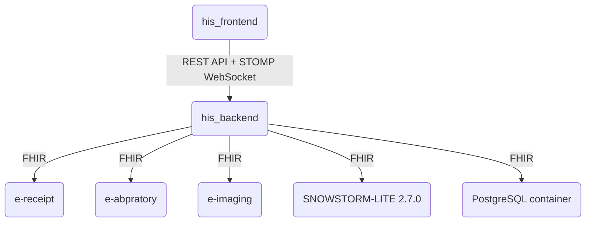

# Wysokopoziomowa architektura systemu



### Założenia:

Aplikacja his_frontend jest interfejsem do obsługi systemu HIS od strony pracownika szpitala, pozwala na:

- zarządzanie wizytami pacjenta,
- wystawianie e-recept,
- wystawieniem zleceń e-obrazowań
- wystawianiem zleceń badań laboratoryjnych.
  W kontekście tego interfejsu działają role (użytkownicy) lekarze różnych specjalizacji i personel medyczny.

Serwis his_backend stanowi główny backend systemu HIS i wykonuje funkcje oprogramowania, zarządza danymi przechowywanymi w bazie danych (i początkowego ładowania danych z liquibase). Ponadto zarządza wybieraniem klasyfikacji chorób, objawów, procedur medycznych według specjalizacji danego użytkownika-lekarza.

Instancja SNOWSTORM-LITE zapewnia dostęp do klasyfikacji SNOMED CT (w tym do terminologii medycznej) i umożliwia wyszukiwanie po kodach SNOMED CT. W systemie HIS przechowywane są jedynie identyfikatory SNOMED CT, a nie pełne dane terminologiczne (dane podlegające licencji snomed ct są niewykorzystywane w danych początkowych importowanych przez liquibase).

Baza danych PostgreSQL przechowuje dane systemu HIS, w tym dane pacjentów, wizyt, recept, zleceń badań laboratoryjnych i obrazowań. Przechowuje odwołania do przyporządkowanych klasyfikacji chorób, objawów i procedur medycznych jako odwołania do identyfikatorów w SNOMED CT (dane SNOMED CT nie są przechowywane w bazie danych, lecz jedynie identyfikatory SNOMED CT).

Serwis e-receipt prosty serwis naśladujący pordstawowe zachowanie systemu e-recept pozwalający zarządzenie wystawionymi e-receptami i zmianie stanu tych zleceń recept. Serwis wystawia zintegrowany interfejs Thymeleaf, który umożliwia zmianę stanu zleceń e-recept (brak uwierzytelniania do interfejsu ui). Zmiana stanu wystawionych e-recept w serwisie e-recept wpływa na późniejszy stan zleceń e-recept w systemie HIS. Serwis e-receopt jest połączony z systemem HIS poprzez FHIR z zastosowaniem mTLS.

Serwis e-laboratory prosty serwis naśladujący pordstawowe zachowanie systemu zleceń laboratoryjnych pozwalający zarządzenie wystawionymi zleceniami i zmianie stanu tych zleceń. Serwis wystawia zintegrowany interfejs Thymeleaf, który umożliwia zmianę stanu zleceń badań (brak uwierzytelniania do interfejsu ui). Zmiana stanu wystawionych zleceń w serwisie e-laboratory wpływa na późniejszy stan zleceń badań w systemie HIS. Serwis jest połączony z systemem HIS poprzez FHIR z zastosowaniem mTLS.

Serwis e-imaging prosty serwis naśladujący pordstawowe zachowanie systemu zleceń badań obrazowych pozwalający zarządzenie wystawionymi zleceniami i zmianie stanu tych zleceń. Serwis wystawia zintegrowany interfejs Thymeleaf, który umożliwia zmianę stanu zleceń badań (brak uwierzytelniania do interfejsu ui). Zmiana stanu wystawionych zleceń w serwisie e-imaging wpływa na późniejszy stan zleceń badań w systemie HIS. Serwis jest połączony z systemem HIS poprzez FHIR z zastosowaniem mTLS.

---

# Uruchomienie lokalne (Docker Compose)

Jeden plik `deploy/compose.yml` definiuje cały stos (postgres, his-backend, his-frontend, e-receipt,
e-laboratory, e-imaging, opcjonalnie snowstorm-lite w profilu `terminology`). Lokalnie dokłada się
nakładkę `deploy/compose.dev.yml` (build z źródeł, porty na `127.0.0.1`) i `deploy/local.env`.

Połączenia FHIR między his_backend a e-receipt / e-laboratory / e-imaging są zabezpieczone mTLS
(domyślnie włączone). Certyfikaty (CA `HIS-CA`, po jednym `keystore.p12` + `truststore.p12` na aplikację)
leżą w `.certs/` (poza repo, `.gitignore`), a hasła w `.certs/passwords.env`. Brakujące certyfikaty
wygeneruje skrypt (bash, wymaga `openssl` i `keytool`; istniejącej CA nie nadpisuje):

```bash
scripts/gen-certs.sh            # domyślnie .certs w katalogu głównym repo; opcjonalny argument: katalog wyjściowy
```

`deploy/local.env` nie jest w repo (jest w `.gitignore`) - przy pierwszym uruchomieniu utwórz go z szablonu
i wpisz w nim osiem haseł `HIS_BACKEND_*`, `E_RECEIPT_*`, `E_LABORATORY_*`, `E_IMAGING_*`
(`*_KEYSTORE_PASSWORD`, `*_TRUSTSTORE_PASSWORD`) z `.certs/passwords.env` (compose bez nich nie wystartuje):

```powershell
Copy-Item deploy/local.env.example deploy/local.env
```

Compose montuje `${HIS_CERTS_DIR}/<usługa>` (domyślnie `../.certs` względem `deploy/`) do kontenerów pod `/certs`
tylko do odczytu. Wyłączenie mTLS (np. testy bez certyfikatów): `HIS_MTLS_ENABLED=false`.

Pełny stos (z poziomu root katalogu projektu; `pnpm stack:up` / `pnpm stack:down`):

```powershell
docker compose -f deploy/compose.yml -f deploy/compose.dev.yml --env-file deploy/local.env up -d --build
docker compose -f deploy/compose.yml -f deploy/compose.dev.yml --env-file deploy/local.env down
```

Frontend: http://localhost:10400, backend (API): http://localhost:10420, Postgres: `127.0.0.1:5432`
(baza/użytkownik/hasło `his`). Logowanie demo: `admin` / `admin`.
UI symulatorów (HTTP, bez certyfikatu): e-receipt http://localhost:10431, e-laboratory http://localhost:10432,
e-imaging http://localhost:10433. FHIR (HTTPS z certyfikatem klienta, np. do `curl`): his_backend `https://localhost:10424/fhir`,
e-receipt `https://localhost:10421/fhir`, e-laboratory `:10422`, e-imaging `:10423`. Health: osobne porty zarządzania
(10440-10443) wewnątrz kontenerów, nie publikowane na host.

Tryb IDE (backend z IntelliJ/Maven, profil `dev`, bez certyfikatów: `HIS_MTLS_ENABLED=false`, ustawia to
`pnpm start:backend`) - uruchamiamy tylko bazę (`pnpm stack:db`) i NIE startujemy kontenera `his-backend`
(konflikt portu 10420). W tym trybie `/fhir/**` w backendzie jest nieczynne (integracja z e-* wymaga mTLS):

```powershell
docker compose -f deploy/compose.yml -f deploy/compose.dev.yml --env-file deploy/local.env up -d postgres
pnpm start:backend
```

Wolumeny stosu: `hospital-information-system_postgres-data` (baza) i
`hospital-information-system_snowstorm-lite-data` (indeks Snowstorm; wymaga importu RF2).
Jeśli porty 5432/8080 są zajęte, ustaw `HIS_DB_HOST_PORT` / `HIS_SNOWSTORM_HOST_PORT` w `deploy/local.env`.
Wdrożenie certyfikatów na serwer produkcyjny: `.github/pipeline_docs/production_deployment.md` (sekcja "mTLS (FHIR)").

# Uruchomienie kontenera SNOWSTORM lite i dostarczenie danych:

1. uruchomienie kontenera SNOWSTORM lite ( z poziomu root katalogu projektu)

```powershell
PS P:\Hospital_Information_System> docker compose -f deploy/compose.yml -f deploy/compose.dev.yml --env-file deploy/local.env --profile terminology up -d
```

2. załadowanie danych (z poziomu katalogu zawierającego plik '')

```powershell
PS D:\SNOMED_CT_international_release(licensed-non-commercial)> ls


    Directory: D:\SNOMED_CT_international_release(licensed-non-commercial)


Mode                 LastWriteTime         Length Name
----                 -------------         ------ ----
-a----        30.09.2026     18:15         363728 doc_SnomedCTReleaseNotes_Current-en-US_INT_20261001.pdf
-a----        30.09.2026     18:23      587754816 SnomedCT_InternationalRF2_PRODUCTION_20261001T120000Z.zip


PS D:\SNOMED_CT_international_release(licensed-non-commercial)> C:\Windows\System32\curl.exe -u admin:admin `
>>   --form file=@SnomedCT_InternationalRF2_PRODUCTION_20261001T120000Z.zip `
>>   --form version-uri="http://snomed.info/sct/900000000000207008/version/20261001" `
>>   http://localhost:8080/fhir-admin/load-package


```

3. weryfikacja importu

http://localhost:8080/fhir/?tx=http%3A%2F%2Flocalhost%3A8080%2Ffhir#syndication

w 'Installed SNOMED CT Editions' powinna pojawić się wersja '20261001'

Po tych krokach uruchom aplikację z `HIS_SNOWSTORM_ENABLED=true` (w `deploy/local.env`)

4. zatrzymanie :

```powershell
PS P:\Hospital_Information_System> docker compose -f deploy/compose.yml -f deploy/compose.dev.yml --env-file deploy/local.env --profile terminology down
[+] down 2/2
 ✔ Container his-dev-postgres-1 Removed                                                                                                                                                             0.6s
 ! Network his-dev_default      Resource is still in use                                                                                                                                            0.0s
PS P:\Hospital_Information_System>
```
