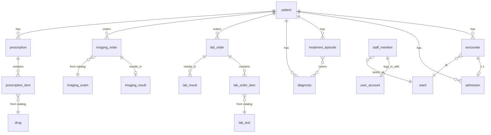

# Database schema

Entities, relationships, and pointers to the files with detailed field definitions.

## Relationship diagram (summary)

Engine: PostgreSQL 17. The schema is created exclusively through database migrations. Primary keys are
identifiers generated by the application (exception: catalog tables with a natural key, such as a
laboratory test code or an imaging exam code).

## Schema files

| File                               | Tables                                                                                                                                                                                                                     |
| ---------------------------------- | -------------------------------------------------------------------------------------------------------------------------------------------------------------------------------------------------------------------------- |
| `schema/001-staff.sql`             | `ward`, `staff_member`, `user_account`                                                                                                                                                                                     |
| `schema/002-patient-admission.sql` | `patient`, `patient_flag`, `treatment_episode`, `encounter`, `admission`                                                                                                                                                   |
| `schema/003-ehr.sql`               | `clinical_note`, `clinical_note_symptom`, `diagnosis`, `episode_diagnosis`, `allergy`, `allergy_atc_code`, `contraindication`, `treatment`                                                                                 |
| `schema/004-catalogs.sql`          | `lab_test`, `lab_test_specimen`, `lab_analyte_definition`, `lab_panel`, `lab_panel_test`, `imaging_exam`, `schedule_slot`, `drug`, `drug_route`, `drug_reimbursement_option`, `drug_interacts_with_atc`, `vital_threshold` |
| `schema/005-lab.sql`               | `lab_order`, `lab_order_item`, `lab_order_status_change`, `lab_result`, `lab_observation`                                                                                                                                  |
| `schema/006-imaging.sql`           | `imaging_order`, `imaging_order_status_change`, `imaging_result`                                                                                                                                                           |
| `schema/007-prescription.sql`      | `prescription`, `prescription_item`, `prescription_item_time_of_day`                                                                                                                                                       |
| `schema/008-vitals.sql`            | `vital_signs`                                                                                                                                                                                                              |
| `schema/009-messaging.sql`         | `message_thread`, `thread_participant`, `message`, `clinical_alert`, `alert_acknowledgement`, `team_task`, `handoff_note`, `handoff_patient_note`                                                                          |

Schema changes are made exclusively through a new migration step - editing an existing step prevents the
application from starting.

## Medical coding

The only terminology code actively written by the user interface is SNOMED CT (used in diagnoses and in
the clinical indications of laboratory/imaging orders). The database does not store the full SNOMED CT
terminology - only code identifiers, served by the Snowstorm Lite service. The ICD-10 classification is
not a local dictionary - it is computed dynamically from the SNOMED CT code. The drug catalog additionally
stores the ATC classification, actively used to check drug interactions.

## Main entities

### Patients and admissions

| Entity             | Key fields                                                                                                                                                                   |
| ------------------ | ---------------------------------------------------------------------------------------------------------------------------------------------------------------------------- |
| `Patient`          | medical record number, national ID, first/last name, date of birth, gender, address/contact/insurance, blood type, status (registered/admitted/outpatient/discharged), flags |
| `Encounter`        | visit type (visit/consultation/hospitalization/emergency/teleconsultation), status (planned/in progress/finished/cancelled), start/end time, ward, doctor, treatment episode |
| `Admission`        | status (active/discharged/cancelled), admission type (planned/emergency/transfer/outpatient), triage level, ward, attending physician, discharge disposition                 |
| `TreatmentEpisode` | title, start/end time, status (active/closed), linked diagnoses                                                                                                              |

A patient can have at most one active admission at a time. Treatment episodes come exclusively from
initial data - nothing in the application creates new episodes.

### Staff

| Entity        | Key fields                                                                                                                |
| ------------- | ------------------------------------------------------------------------------------------------------------------------- |
| `Ward`        | name, short name, floor, number of beds                                                                                   |
| `StaffMember` | role (see [userRoles](userRoles_en.md)), specialization, ward, medical license number, employee number                    |
| `UserAccount` | staff member reference, login, password hash, account status (pending/active/locked), failed login attempts, lockout time |

### Clinical documentation (EHR)

| Entity         | Key fields                                                                                         |
| -------------- | -------------------------------------------------------------------------------------------------- |
| `ClinicalNote` | category (admission/progress/consultation/nursing/observation/discharge), title, content, symptoms |
| `Diagnosis`    | SNOMED CT code, type (primary/secondary/chronic), status (active/resolved), diagnosis date         |

### Laboratory orders

| Entity         | Key fields                                                                                                        |
| -------------- | ----------------------------------------------------------------------------------------------------------------- |
| `LabOrder`     | urgency (routine/urgent/stat), fasting requirement, clinical indication, status, order items, status history      |
| `LabOrderItem` | test code and name, specimen type                                                                                 |
| `LabResult`    | test code and name, category, result status (preliminary/final/corrected), review date and reviewer, observations |

### Imaging orders

| Entity          | Key fields                                                                                                           |
| --------------- | -------------------------------------------------------------------------------------------------------------------- |
| `ImagingOrder`  | exam, modality, body region, laterality, contrast use, clinical indication, safety checklist, scheduled slot, status |
| `ImagingResult` | findings, conclusion, result status, critical flag, review date and reviewer                                         |

### Prescriptions

| Entity             | Key fields                                                                                                                                    |
| ------------------ | --------------------------------------------------------------------------------------------------------------------------------------------- |
| `Prescription`     | kind (e-prescription/hospital order), status (issued/partially dispensed/dispensed/cancelled/expired), access code, e-prescription key, items |
| `PrescriptionItem` | drug name, active substance, strength, form, dosage, reimbursement, times of day                                                              |

The "expired" status is computed when the prescription is read, based on its validity date - it is not
permanently written to the database at the moment of expiry.

### Vital signs, messaging, alerts

| Entity                                            | Key fields                                                                                                                        |
| ------------------------------------------------- | --------------------------------------------------------------------------------------------------------------------------------- |
| `VitalSigns`                                      | systolic/diastolic blood pressure, heart rate, oxygen saturation, respiratory rate, temperature, pain score, context, source      |
| `MessageThread` / `Message` / `ThreadParticipant` | subject, body, priority (normal/high/critical), last-read timestamp per participant                                               |
| `ClinicalAlert` / `AlertAcknowledgement`          | type (critical result/vital anomaly/order status/task/system), severity (info/warning/critical), target, per-user acknowledgement |
| `TeamTask`                                        | a team task with an assignee and an author                                                                                        |
| `HandoffNote`                                     | a shift handoff note between wards, with a list of patients it covers                                                             |

Vital sign measurements are immutable - a correction is written as a new row, not an overwrite of the
existing one.

## Initial data

The system loads two sets of initial data: a baseline set (always loaded, including in production - vital
sign alert thresholds and demo accounts) and an extended set (development environment only - staff,
catalogs, patients, clinical documentation, orders, prescriptions, messages). Account details: see
[userRoles](userRoles_en.md).
