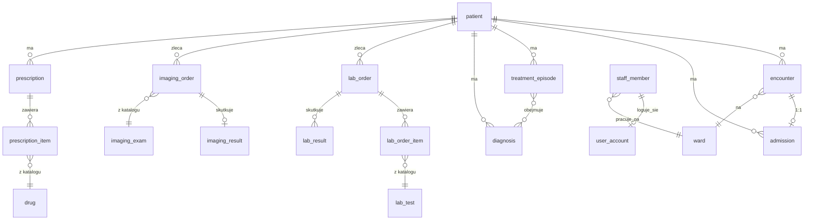

# Schemat bazy danych

Encje, relacje i odwołania do plików ze szczegółowymi definicjami pól.

## Diagram relacji (skrót)

Silnik: PostgreSQL 17. Schemat tworzony jest wyłącznie przez migracje bazy danych. Klucze główne to
identyfikatory generowane w aplikacji (wyjątek: tabele katalogowe z naturalnym kluczem, np. kod badania
laboratoryjnego czy kod badania obrazowego).

## Pliki schematu

| Plik                               | Tabele                                                                                                                                                                                                                     |
| ---------------------------------- | -------------------------------------------------------------------------------------------------------------------------------------------------------------------------------------------------------------------------- |
| `schema/001-staff.sql`             | `ward`, `staff_member`, `user_account`                                                                                                                                                                                     |
| `schema/002-patient-admission.sql` | `patient`, `patient_flag`, `treatment_episode`, `encounter`, `admission`                                                                                                                                                   |
| `schema/003-ehr.sql`               | `clinical_note`, `clinical_note_symptom`, `diagnosis`, `episode_diagnosis`, `allergy`, `allergy_atc_code`, `contraindication`, `treatment`                                                                                 |
| `schema/004-catalogs.sql`          | `lab_test`, `lab_test_specimen`, `lab_analyte_definition`, `lab_panel`, `lab_panel_test`, `imaging_exam`, `schedule_slot`, `drug`, `drug_route`, `drug_reimbursement_option`, `drug_interacts_with_atc`, `vital_threshold` |
| `schema/005-lab.sql`               | `lab_order`, `lab_order_item`, `lab_order_status_change`, `lab_result`, `lab_observation`                                                                                                                                  |
| `schema/006-imaging.sql`           | `imaging_order`, `imaging_order_status_change`, `imaging_result`                                                                                                                                                           |
| `schema/007-prescription.sql`      | `prescription`, `prescription_item`, `prescription_item_time_of_day`                                                                                                                                                       |
| `schema/008-vitals.sql`            | `vital_signs`                                                                                                                                                                                                              |
| `schema/009-messaging.sql`         | `message_thread`, `thread_participant`, `message`, `clinical_alert`, `alert_acknowledgement`, `team_task`, `handoff_note`, `handoff_patient_note`                                                                          |

Zmiana schematu odbywa się wyłącznie nowym krokiem migracji - edycja istniejącego kroku przerywa start
aplikacji.

## Kodowanie medyczne

Jedynym kodem terminologicznym aktywnie zapisywanym przez interfejs użytkownika jest SNOMED CT (w
diagnozach i wskazaniach klinicznych zleceń laboratoryjnych/obrazowych). Baza nie przechowuje pełnej
terminologii SNOMED CT - tylko identyfikatory kodów, serwowane przez usługę Snowstorm Lite. Klasyfikacja
ICD-10 nie jest lokalnym słownikiem - jest liczona dynamicznie na podstawie kodu SNOMED CT. Katalog leków
dodatkowo przechowuje klasyfikację ATC, aktywnie używaną do sprawdzania interakcji leków.

## Encje główne

### Pacjent i przyjęcia

| Encja              | Kluczowe pola                                                                                                                                                                         |
| ------------------ | ------------------------------------------------------------------------------------------------------------------------------------------------------------------------------------- |
| `Patient`          | numer księgi głównej, PESEL, imię/nazwisko, data urodzenia, płeć, adres/kontakt/ubezpieczenie, grupa krwi, status (zarejestrowany/przyjęty/pacjent ambulatoryjny/wypisany), flagi     |
| `Encounter`        | typ wizyty (wizyta/konsultacja/hospitalizacja/stan nagły/teleporada), status (zaplanowana/w toku/zakończona/odwołana), czas rozpoczęcia/zakończenia, oddział, lekarz, epizod leczenia |
| `Admission`        | status (aktywne/wypisane/odwołane), typ przyjęcia (planowe/nagłe/przeniesienie/ambulatoryjne), poziom triażu, oddział, lekarz prowadzący, sposób zakończenia pobytu                   |
| `TreatmentEpisode` | tytuł, czas rozpoczęcia/zakończenia, status (aktywny/zamknięty), powiązane diagnozy                                                                                                   |

Pacjent może mieć maksymalnie jedno aktywne przyjęcie w danym momencie. Epizody leczenia pochodzą
wyłącznie z danych początkowych - nic w aplikacji nie tworzy nowych epizodów.

### Personel

| Encja         | Kluczowe pola                                                                                                                              |
| ------------- | ------------------------------------------------------------------------------------------------------------------------------------------ |
| `Ward`        | nazwa, skrócona nazwa, piętro, liczba łóżek                                                                                                |
| `StaffMember` | rola (zob. [userRoles](userRoles_pl.md)), specjalizacja, oddział, numer prawa wykonywania zawodu, numer pracownika                         |
| `UserAccount` | identyfikator pracownika, login, hash hasła, status konta (oczekujące/aktywne/zablokowane), liczba nieudanych prób logowania, czas blokady |

### Dokumentacja medyczna (EHR)

| Encja          | Kluczowe pola                                                                                       |
| -------------- | --------------------------------------------------------------------------------------------------- |
| `ClinicalNote` | kategoria (przyjęcie/przebieg/konsultacja/pielęgniarska/obserwacja/wypis), tytuł, treść, objawy     |
| `Diagnosis`    | kod SNOMED CT, typ (główna/współistniejąca/przewlekła), status (aktywna/ustąpiła), data rozpoznania |

### Zlecenia laboratoryjne

| Encja          | Kluczowe pola                                                                                                                     |
| -------------- | --------------------------------------------------------------------------------------------------------------------------------- |
| `LabOrder`     | priorytet (rutynowe/pilne/natychmiastowe), wymóg bycia na czczo, wskazanie kliniczne, status, pozycje zlecenia, historia statusów |
| `LabOrderItem` | kod i nazwa badania, typ materiału biologicznego                                                                                  |
| `LabResult`    | kod i nazwa badania, kategoria, status wyniku (wstępny/końcowy/skorygowany), data i osoba zatwierdzająca, obserwacje              |

### Zlecenia obrazowe

| Encja           | Kluczowe pola                                                                                                                    |
| --------------- | -------------------------------------------------------------------------------------------------------------------------------- |
| `ImagingOrder`  | badanie, modalność, okolica anatomiczna, stronność, podanie kontrastu, wskazanie kliniczne, lista bezpieczeństwa, termin, status |
| `ImagingResult` | opis, wniosek, status wyniku, flaga krytyczności, data i osoba zatwierdzająca                                                    |

### Recepty

| Encja              | Kluczowe pola                                                                                                                                       |
| ------------------ | --------------------------------------------------------------------------------------------------------------------------------------------------- |
| `Prescription`     | rodzaj (e-recepta/zlecenie szpitalne), status (wystawiona/częściowo wydana/wydana/anulowana/wygasła), kod dostępu, identyfikator e-recepty, pozycje |
| `PrescriptionItem` | nazwa leku, substancja aktywna, siła dawki, postać, dawkowanie, refundacja, godziny podania                                                         |

Status "wygasła" jest wyliczany przy odczycie na podstawie daty ważności recepty, nie jest trwale zapisywany
w bazie w momencie wygaśnięcia.

### Parametry życiowe, wiadomości, alerty

| Encja                                             | Kluczowe pola                                                                                                                                                       |
| ------------------------------------------------- | ------------------------------------------------------------------------------------------------------------------------------------------------------------------- |
| `VitalSigns`                                      | ciśnienie skurczowe/rozkurczowe, tętno, saturacja, częstość oddechów, temperatura, skala bólu, kontekst, źródło                                                     |
| `MessageThread` / `Message` / `ThreadParticipant` | temat, treść, priorytet (normalny/wysoki/krytyczny), znacznik czasu ostatniego odczytu per uczestnik                                                                |
| `ClinicalAlert` / `AlertAcknowledgement`          | typ (wynik krytyczny/anomalia parametrów/status zlecenia/zadanie/systemowy), istotność (informacyjna/ostrzeżenie/krytyczna), odbiorca, potwierdzenie per użytkownik |
| `TeamTask`                                        | zadanie zespołowe z przypisaną osobą i autorem                                                                                                                      |
| `HandoffNote`                                     | notatka przekazania zmiany między oddziałami, z listą dotyczących jej pacjentów                                                                                     |

Pomiar parametrów życiowych jest niemutowalny - korekta zapisuje się jako nowy wiersz, nie nadpisuje
istniejącego.

## Dane początkowe

System ładuje dwa zestawy danych początkowych: podstawowy (ładowany zawsze, również na produkcji - progi
alarmowe parametrów życiowych i konta demo) oraz rozszerzony (tylko środowisko deweloperskie - pracownicy,
katalogi, pacjenci, dokumentacja medyczna, zlecenia, recepty, wiadomości). Szczegóły kont: zob.
[userRoles](userRoles_pl.md).
