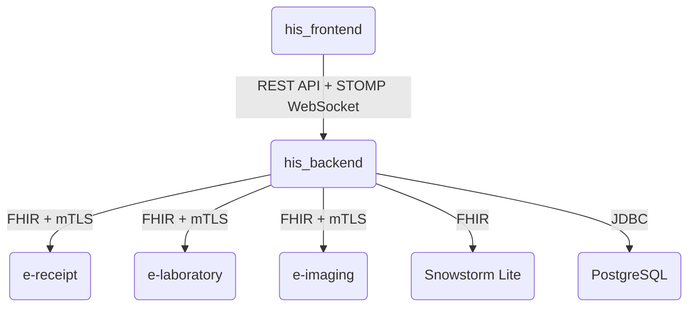

# Services

The services that make up the system and how they communicate with each other.

## his_frontend

The interface used by hospital staff: managing patient visits, issuing e-prescriptions, and placing
imaging and laboratory orders. Does not expose its own API or automatic documentation. Doctors of various
specializations and other medical staff work through this interface, each with their own role - see
[userRoles](userRoles_en.md).

- Communicates with his_backend over REST and WebSocket, both routed through a shared proxy server.

## his_backend

The system's main backend: domain logic, patient and staff data management, selecting the relevant medical
terminology for a doctor's specialization, and user authentication. Exposes live, automatically generated
API documentation.

- REST API and WebSocket for his_frontend on a single port.
- An mTLS-protected FHIR interface for integration with e-receipt/e-laboratory/e-imaging on a separate
  port.
- API documentation (Swagger UI and the OpenAPI specification) is publicly available on the REST port - a
  risk level comparable to the service's public health-check endpoint, acceptable given the internal
  network deployment.

## Snowstorm Lite

Provides SNOMED CT medical terminology - searching codes and translating them to the ICD-10
classification. The system's database stores only code identifiers, not the terminology itself (data
covered by the SNOMED CT license is not part of the repository).

- An optional service, disabled by default - requires a one-time import of terminology data (see
  [localDeploy](localDeploy_en.md)) and enabling the integration in configuration. Without imported data,
  terminology queries fail.

## PostgreSQL

Stores the system's data: patients, visits, prescriptions, laboratory and imaging orders, and references
to medical terminology codes (without the terminology itself). Schema described in
[databaseSchema](databaseSchema_en.md).

## e-receipt, e-laboratory, e-imaging

Services that simulate external e-prescription, laboratory order, and imaging order systems, compliant
with the FHIR healthcare data exchange standard. Each exposes a simple web interface for updating order
status and an mTLS-protected FHIR interface. Order and result state in these services is temporary
(cleared on restart) - his_backend always holds the authoritative state. A status change made in an e-*
web interface is first confirmed with the main system; if the main system rejects it, the change is
blocked, and if the main system is unavailable, the change is kept locally until it can be resynchronized.

| Service      | FHIR resource                                          | Web interface        |
| ------------ | ------------------------------------------------------ | -------------------- |
| e-receipt    | prescription (`MedicationRequest`)                     | yes, no login needed |
| e-laboratory | order (`ServiceRequest`) + result (`DiagnosticReport`) | yes, no login needed |
| e-imaging    | order (`ServiceRequest`) + result (`DiagnosticReport`) | yes, no login needed |

Each integration (his_backend to e-receipt/e-laboratory/e-imaging) is enabled and disabled independently in
configuration and is disabled by default. Laboratory and imaging order statuses are shared between the
main system and the simulating service - the status change flow is described in
[basicWorkflows](basicWorkflows_en.md). None of the e-* services expose automatic API documentation.

## mTLS between his_backend and e-receipt/e-laboratory/e-imaging

FHIR communication between the main system and the simulating services is secured by mutual certificate
authentication (mTLS) by default - a trusted client certificate is the only form of authentication. Without
mTLS, the integration runs without authentication and is intended for testing only.

| Service      | FHIR port (mTLS) | API/UI port | Health-check port |
| ------------ | ---------------- | ----------- | ----------------- |
| his_backend  | 10424            | 10420       | 10440             |
| e-receipt    | 10421            | 10431       | 10441             |
| e-laboratory | 10422            | 10432       | 10442             |
| e-imaging    | 10423            | 10433       | 10443             |

Certificate generation is described in [localDeploy](localDeploy_en.md); the matching configuration
variables are in [envVariables](envVariables_en.md).

## Service health checks

| Service      | Access                                                        |
| ------------ | ------------------------------------------------------------- |
| his_backend  | public, no details exposed; port is not published to the host |
| e-*          | public; port is not published to the host                     |
| his_frontend | checked by requesting the home page                           |

## Proxy and rate limits (his_frontend)

The proxy server in front of his_frontend forwards API and WebSocket traffic to his_backend and limits the
number of requests per IP address, to protect against login abuse and excessive load.

- Login: at most 5 requests per minute per IP address.
- Other API requests: a general limit, considerably higher than for login.
- WebSocket: no request limit.

## Authentication between the main system and the frontend

The frontend logs in to the main system and receives a short-lived access token, refreshed automatically
in the background. Locking an account or changing a user's role immediately invalidates any tokens already
issued, regardless of when they would otherwise expire.
