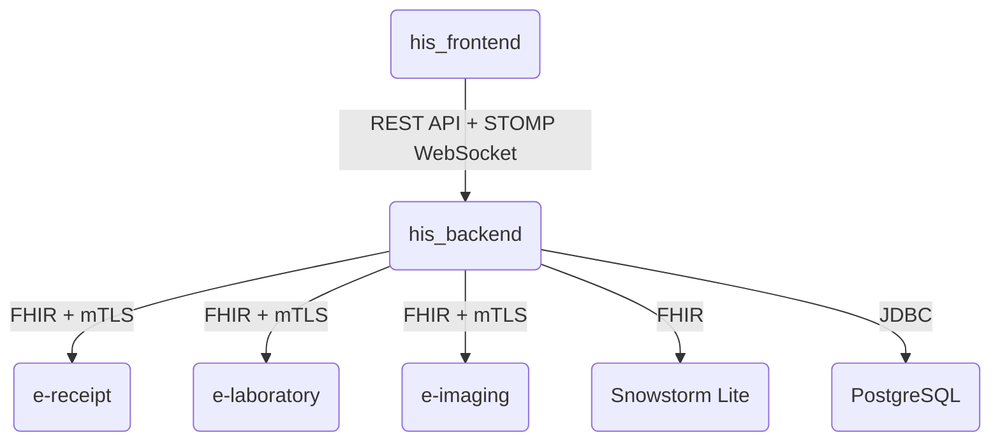

# Serwisy

Serwisy wchodzące w skład systemu i sposób komunikacji między nimi.

## his_frontend

Interfejs dla personelu szpitala: zarządzanie wizytami pacjenta, wystawianie e-recept, zleceń obrazowych i
badań laboratoryjnych. Nie wystawia własnego API ani dokumentacji automatycznej. Przez ten interfejs
pracują lekarze różnych specjalizacji oraz inny personel medyczny, każdy w swojej roli - zob.
[userRoles](userRoles_pl.md).

- Komunikacja z his_backend przez REST oraz WebSocket, obie trasy przechodzą przez wspólny serwer proxy.

## his_backend

Główny backend systemu: logika domenowa, zarządzanie danymi pacjentów i personelu, dobór terminologii
medycznej według specjalizacji lekarza, uwierzytelnianie użytkowników. Udostępnia żywą dokumentację API
generowaną automatycznie z aktualnych endpointów.

- REST API i WebSocket dla his_frontend na jednym porcie.
- Interfejs FHIR (zabezpieczony mTLS) dla integracji z e-receipt/e-laboratory/e-imaging na osobnym porcie.
- Dokumentacja API (Swagger UI i specyfikacja OpenAPI) dostępna publicznie na porcie REST - zakres ryzyka
  porównywalny z publicznym endpointem stanu zdrowia usługi, uzasadniony wdrożeniem w sieci wewnętrznej.

## Snowstorm Lite

Udostępnia terminologię medyczną SNOMED CT - wyszukiwanie kodów i tłumaczenie ich na klasyfikację ICD-10.
Baza systemu przechowuje tylko identyfikatory kodów, nie samą terminologię (dane objęte licencją SNOMED CT
nie są częścią repozytorium).

- Usługa opcjonalna, wyłączona domyślnie - wymaga jednorazowego importu danych terminologicznych (zob.
  [localDeploy](localDeploy_pl.md)) i włączenia integracji w konfiguracji. Bez zaimportowanych danych
  zapytania o terminologię kończą się błędem.

## PostgreSQL

Przechowuje dane systemu: pacjentów, wizyt, recept, zleceń laboratoryjnych i obrazowych oraz odwołania do
kodów terminologii medycznej (bez samej terminologii). Schemat opisany w
[databaseSchema](databaseSchema_pl.md).

## e-receipt, e-laboratory, e-imaging

Serwisy symulujące zewnętrzne systemy e-recept, zleceń laboratoryjnych i zleceń obrazowych, zgodne ze
standardem wymiany danych medycznych FHIR. Każdy wystawia prosty interfejs webowy do zmiany stanu
zleceń oraz interfejs FHIR zabezpieczony mTLS. Stan zleceń i wyników w tych serwisach jest tymczasowy
(czyszczony przy restarcie) - his_backend jest zawsze stanem docelowym. Zmiana stanu zlecenia w interfejsie
e-* jest najpierw potwierdzana przez system główny; jeśli system główny odmówi, zmiana jest blokowana, a
jeśli jest niedostępny, zmiana zostaje zapisana lokalnie do czasu ponownej synchronizacji.

| Serwis       | Zasób FHIR                                               | Interfejs webowy   |
| ------------ | -------------------------------------------------------- | ------------------ |
| e-receipt    | recepta (`MedicationRequest`)                            | tak, bez logowania |
| e-laboratory | zlecenie (`ServiceRequest`) + wynik (`DiagnosticReport`) | tak, bez logowania |
| e-imaging    | zlecenie (`ServiceRequest`) + wynik (`DiagnosticReport`) | tak, bez logowania |

Każda integracja (his_backend -> e-receipt/e-laboratory/e-imaging) jest włączana i wyłączana niezależnie w
konfiguracji i domyślnie jest wyłączona. Statusy zleceń laboratoryjnych i obrazowych są współdzielone
między systemem głównym a serwisem symulującym - przebieg zmiany statusu opisany jest w
[basicWorkflows](basicWorkflows_pl.md). Żaden z serwisów e-* nie wystawia automatycznej dokumentacji API.

## mTLS między his_backend a e-receipt/e-laboratory/e-imaging

Komunikacja FHIR między systemem głównym a serwisami symulującymi jest domyślnie zabezpieczona wzajemnym
uwierzytelnianiem certyfikatami (mTLS) - jedynym sposobem uwierzytelnienia jest zaufany certyfikat klienta.
Bez mTLS integracja działa bez uwierzytelniania i jest przeznaczona wyłącznie do testów.

| Usługa       | Port FHIR (mTLS) | Port API/UI | Port stanu zdrowia usługi |
| ------------ | ---------------- | ----------- | ------------------------- |
| his_backend  | 10424            | 10420       | 10440                     |
| e-receipt    | 10421            | 10431       | 10441                     |
| e-laboratory | 10422            | 10432       | 10442                     |
| e-imaging    | 10423            | 10433       | 10443                     |

Generowanie certyfikatów opisane w [localDeploy](localDeploy_pl.md), odpowiadające zmienne konfiguracyjne w
[envVariables](envVariables_pl.md).

## Stan usług (health check)

| Usługa       | Dostęp                                                      |
| ------------ | ----------------------------------------------------------- |
| his_backend  | publiczny, bez szczegółów; port nie jest wystawiony na host |
| e-*          | publiczny; port nie jest wystawiony na host                 |
| his_frontend | sprawdzana dostępność strony głównej                        |

## Proxy i limity żądań (his_frontend)

Serwer proxy przed his_frontend przekazuje ruch API i WebSocket do his_backend i ogranicza liczbę żądań na
adres IP, aby chronić przed nadużyciami logowania i nadmiernym obciążeniem.

- Logowanie: maksymalnie 5 żądań na minutę na adres IP.
- Pozostałe żądania API: limit ogólny, znacznie wyższy niż dla logowania.
- WebSocket: bez limitu żądań.

## Uwierzytelnianie między systemem głównym a frontendem

Frontend loguje się do systemu głównego i otrzymuje token dostępowy o krótkim czasie życia, odświeżany
automatycznie w tle. Zablokowanie konta lub zmiana roli użytkownika natychmiast unieważnia już wydane
tokeny, niezależnie od tego, kiedy wygasają.
